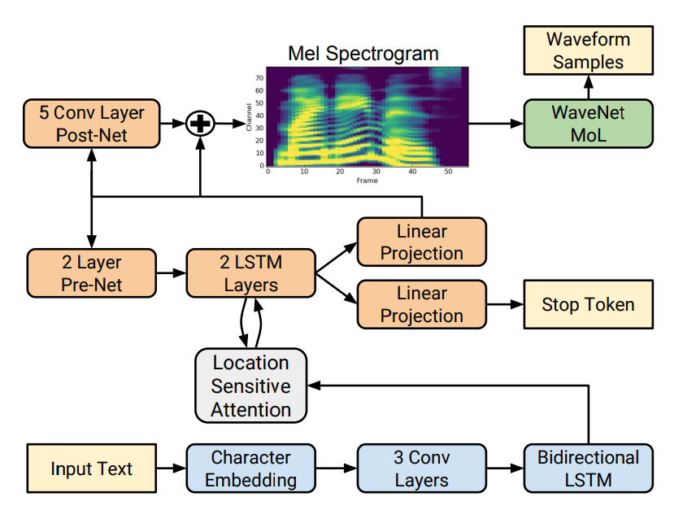

# Tacotron2

---

### **NATURAL TTS SYNTHESIS BY CONDITIONING WAVENET ON MEL SPECTROGRAM
PREDICTIONS**

## Index

1. Introduction
2. Model Architecture
3. Experiments
4. Implementation

Arxiv : [https://arxiv.org/abs/1712.05884v2](https://arxiv.org/abs/1712.05884v2)

Audio Samples : [https://google.github.io/tacotron/publications/tacotron2/](https://google.github.io/tacotron/publications/tacotron2/)

Code Implementation : https://github.com/NVIDIA/tacotron2

Code Example : [https://pytorch.org/audio/stable/tutorials/tacotron2_pipeline_tutorial.html](https://pytorch.org/audio/stable/tutorials/tacotron2_pipeline_tutorial.html)

Tacotron2 api :  [https://pytorch.org/audio/stable/generated/torchaudio.models.Tacotron2.html#torchaudio.models.Tacotron2](https://pytorch.org/audio/stable/generated/torchaudio.models.Tacotron2.html#torchaudio.models.Tacotron2)

---

## Introduction

과거 Generating TTS SOTA 모델

- Concatenative synthesis with unit selection
- Statistical parametric speech synthesis - Vocoder

→ 여전히 부자연스러움

### WaveNet

- Human speech와 견줄만한 모델
- 상당한 도메인 지식 필요 ( ex. 발음 사전 )

### Tacotron

- Seq2Seq architecture
    - 입력 : sequence of characters
    - 출력 : magnitude spectrograms
- Griffin-Lim Algorithm의 사용
    - 위상정보 ( Phase information )의 추정을 위해 사용
    - iSTFT 전에 사용
- Linguistic / Acoustic features를 하나의 neural network로 처리

### Deep Voice 3

- Tacotron2와 비슷한 접근 방식이지만 결과가 Tacotron에 비해 부자연스러움

### Char2Wav

- Intermediate representation이 다름
- 전통적인 vocoder feature 사용

---

## Model Architecture

Seq2Seq architecture

1. Encoder ( Text → Mel-frequency spectrogram )
2. Decoder ( Mel-Freqeuncy spectrogram → Waveform

위 구조의 장점

- Encoder / Decoder를 분리해서 훈련가능
- Time-domain waveform으로부터 쉽게 계산 가능
- Mel-Frequency spectrogram이 waveform보다 smoother
- 각 프레임에 대해 위상 정보가 바뀌지 않아 square error를 사용하여 계산하기 용이

Mel-Frequency Spectrogram vs Linear Spectrogram

- Mel-Frequency Spectrogram이 더 많은 정보를 버림
- 그래서 iSTFT가 어려움
- 변병된 WaveNet 구조로 이를 해결

모델 구성요소

1. Convolution
2. Bi-directional LSTM
3. Location-sensitive attention
4. Autoregressive recurrent neural network
5. pre-net ( Fully-Connected Layer )
6. post-net ( Convolution )
7. WaveNet Vocoder
8. Stop token ( Probability
    - Dynamic하게 생성의 중단을 결정

## Experiments

Dataset

- Internal US English dataset
    - 24.6 hours

Evaluation

- MOS ( Mean Opinion score )
    - 설문조사와 유사

실험 결과

- Error 발생 상황
    - 발음을 잘 못하는 경우
    - 단어 생략
    - 부자연스러운 음율

Ablation Studies

- Tacotron 모델을 유지하고 intermediate 표현을 Mel → Linear로 바꿨을 때 MOS의 큰 차이가 없음
- WaveNet에 dilated convolution이 있는데 마지막 layer의 convolution의 효용성 확인
- DeepVoice에서 receptive field가 커질수록 성능이 좋아지는 것만은 아님

## 코드 구현