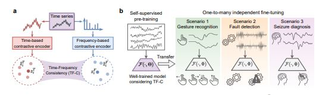

# Self-Supervised Constrastive Pre-Training for Time Series via Time-Frequency Consistency

논문 링크 :  [https://arxiv.org/pdf/2206.08496.pdf](https://arxiv.org/pdf/2206.08496.pdf)

Github : https://github.com/mims-harvard/TFC-pretraining

Posted : 10 / 22 ( NeurIPS 2022 )

## Abstract

- 시계열 데이터에서의 Pre-training은 target 도메인과의 mismatch될 가능성이 존재하고 이를 해결하기 위해서 TF-C time/frequency로 분리가능한 모델 제안
- Constrastive learning을 통해서 train을 진행하고 8개의 데이터셋에서 실험을 진행
- 실험의 결과로 성능은 F1 Score 기준으로 one-to-one setting에서는 15.4%, one-to-many setting에서는 8.4%의 성능향상을 달성

## Introduction

CV와 NLP와는 반대로, 시계열 데이터는 데이터가 복잡함이 pre-training의 성능을 제한한다.

그래서 time-based representation에 constrastive learning, frequency based에는 constrastive instance discrimination을 통해서 embedding 생성

이 논문이 frequency-based constrastive augmentation을 했다는 점에서 최초

또한, 새로운 constrastive loss를 통해서 time-based와 frequency-based 사이의 distance를 최소화 함

데이터셋에 준 변화

1. channel의 개수 (1 ~ 9)
2. time series 길이 ( 128 ~ 5120 )
3. Sampling rates ( 16 ~ 4000 Hz)
4. 다양한 종류의 signal ( EEG, EMG, ECG, acceleration, vibration )

성능을 8개의 baselines로 비교를 진행하였고 one-to-one setting에서 baselines의 평균보다 F1 Score를 15.4% 성능개선, 가장 좋은 baseline 보다 7.2% 성능 개선을 하였고, one-to-many ( 같은 pre-training model 다른 여러 target domains )에 대해서 precision 영역에서 8.4% 성능이 개선 됨을 확인

## Related Work

- Pre-training for time series
    1. self-supervised pre-training for images & self-supervised representation learning 두 연구를 결합한 연구는 존재 x
    2. CV & NLP의 pre-training 모델을 가져오기에는 데이터 양식이 맞지 않음
    3. 여러 transfer learning이 존재하지만 어떤 것이 pre-training에 가장 적합한지 알 수 없어서 TF-C를 다른 시계열 데이터에 대해 변하지 않고 일반화가 가능한 pre-training model 만듦
    4. self-supervised learning에서는 pre-training 할 때 label이 필요하지만 TF-C에서는 label이 필요가 없음
    
- Constrastive learing with time series
    - self-supervised learning에서 인기 있는 방법 중 하나인 encoder를 embedding space와 맵핑하는 방법
    
    1. 시계열 데이터에서 key invariance property를 잡아내는 augmentation을 구별하는 것이 어려워 연구가 상대적으로 적음 →CLOCS, TNC : positive pair를 정의하는데 temporal invariance를 이용
    2. SimCLR(transformation invariance), TS2vec, TS-TCC ( contextual invariance ) 들은 구별하기가 가능
    3. CoST : frequency domain을 사용했지만 augmentation은 time-space에서 적용
    4. BTSF : 동일하게 augmentation을 time-space에서 적용
    
    - 다양한 Augmentation을 하기 위해서 multiple invariance를 이용하는 augmentation bank를 제시
    - Frequency-based augmentation도 제시
    
    
    
    ## Problem Formulation
    
    1. Pre-training dataset
        
        $$
        D^{pret} = \{x^{pret}_{i}~|~i~=~1,...,N \}
        $$
        
    2. fine-tuning dataset
        
        $$
        D^{tune} = \{(x^{tune}_{i},y_{i})~|~i~=~1,...,N \}
        $$
        
    3. channels of dataset
    
    $$
    K^{tune}
    $$
    
    1. timestamps of dataset
        
        $$
        L^{tune}
        $$
        
    2. parameters of model
        
        $$
        Θ
        $$
        
    
    
    
    → 아래 모델 그림 참고
    
    
    

## Approach

- Time-based Contrastive Encoder
    1. Input data
    2. Data Augmentation
        1. Jittering
        2. Scaling
        3. time shifting
        4. neighborhood-segment
    3. Augmented sample을 random 하게 선택해서 encoder 통과 시킴
    4. Embedding space에 저장
    
    Positive Pair : 같은 domain에서 나온 데이터 ( ex. 원본 데이터 x랑 x의 augmented data )
    
    Negative Pair : 다른 domain에서 나온 데이터 (ex. 데이터 x랑 y의 augmented data )
    
    - Constrastive time loss ( constrastive learning에서 널리 사용됨 )
    
    NT-Xent ( the normalized temperature-scaled cross entropy loss )
    
    
    
    sim ( u , v ) : 코사인 유사도
    
- Frequency-based Constrastive Encoder
    1. Input data
    2. Fourier Transform 사용
    3. Data Augmentation
        
        amplitude ( 이때 선택하는 frequency component는 random으로 선택 )
        
        1. Removing Frequency : 푸리에 변환을 해서 나온 frequency component의 진폭을 0으로만들면 frequency component를 제거한 것과 같은 효과
        2. Adding Frequency : 미리 정의한 α = 0.5 보다 진폭이 작은 것을 선택해서 진폭을 0.5로 설정)

T변수는 실제로 성능에 큰 영향이 없기 때문에 실험동안 동일하게 설정해서 사용했다고 함

- Time-Frequency Consistency

  Projector Rt, Rf를 통해서 각 embedding안의 vector를 Time-Frequency space에 joint함

Loss에서 sigma안의 항 : ( 같은 도메인에서 나온 z끼리는 distance 구하지 않는다 )

$$
S^{TK}_{i} : time-based와~frequency-based간~distance
$$

$$
S^{pair}_{i} : time-based와~frequency-based의~pair간~distance
$$

$$
S^{TF}_{i} : time-based와~frequency-based간~distance
$$

$$
S^{TF'}_{i} : time-based와~augemented~frequency-based간~distance
$$

$$
S^{T'F'}_{i} : augmented~time-based와~augmented~frequency-based간~distance
$$

σ : 미리 정의된 상수

- Implementation and Technical Details ( 실질적 전체 loss 함수 )
    
    
    
    
    ⋋ : constrastive와 consistency loss사이의 중요도를 결정
    

## Experiment

time-series classification을 10 baselines와 8 dataset로 비교를 진행

- one-to-one
- one-to-many

Datasets

- [SleepEEG](https://www.physionet.org/content/sleep-edfx/1.0.0/) : univariate brainwaves sleeping stage
- Epliepsy : brain activity of 500 subjects
- FD-A : fault-detection condition A
- FD-B : fault-detection condition B
- HAR : 6 daily activities
- Gesture : 440 samples, 8hand gestures
- ECG : 4 classes based on human physiology
- EMG : muscular diseases
    
    
    

Baselines

 → pre-training model : SleepEEG에 대한 fine-tuneing 결과

→ TNC, CPC는 성능이 좋지 않아서 one-to-one setting만 실시

Encoder G : 3-layer 1-D ResNets as backbone ( datasets이 long time series를 가지고 있어서 transformer보다 좋은 선택이라고 함 )

fully connected layer : Rt, Rf는 서로 parameter 공유 x

- Hyperparameters

Frequency augmentation : E = 1, α = 0.5

loss function ⋋ = 0.5, T = 0.2,  σ  = 1

- One-to-one Pre-Training Evaluation
    - One pre-training dataset
    - One target dataset

  

Scenario 1 : track different physiology

→ 두 데이터는 같은 physiology signal이지만 피실험자가 달라서 physical condition이 다르다는 한계가 존재한다

Scenario 2 : different working condition

Scenario 3 : different working activities

Scenario 4 : signal heart → signal muscle 

→ 전체 : 16 / 24 outperform

- One-to-Many Pre Training Evaluation
    - One Pre-Training dataset
    - Many target datasets
    
    
    

→ One-to-Many에서 저자가 생각한 것보다 성능이 잘 나왔다고 함

→ 전체 : 14 / 18 outperform

- Additional Downstream Tasks : Clustering and Anomaly Detection
    
    
    
    - Clusting Task
        - TF-C의 CLusting Task에서의 좋은 성능은 pre-training으로 전달된 knowledge보다 distinctive representation을 더 잘 잡아낼 수 있다는 것을 의미
    - Anomaly Detection Task
        - FD-A / FD-B dataset에서 수행
        - TF-C가 anomalous sample에 더 민감하고 효과적으로 잡아 낼 수 있음을 보여줌

## Conclusion

- self-supervised contrastive estimation & pre-training model인 TF-C를 제안
- latent space에서 time/frequency-based representation을 더 가깝게 만듦

- Limitation & Future direction
    - temporal autoregressive process → pre-training에 도움예상
    - embed irregular sampled time series에 대해서 ( TF-C는 regular sampled time-series만 잘 될 것으로 예상 )
        
        → ex. Raindrop, SeFT
        
    - Frequency input에 resampling, interpolation로 regular sampled signal 얻는 방법
    - regular/non-uniform FFT ( Fast Fourier Transform ) 사용하는 방법
    - Forecasting task에 적용해보기

- 
    
    Pre-training
    
    - Encoder : 1-D Resnet backbone : 3-layers conv block
        - ( kernel size, strider, depths )
        - ( 8 , 8, 32 )
        - ( 8, 1, 64 )
        - ( 8, 1, 128)
        
        ---
        
        2-layer LSTM, 3-layer Transformer를 사용했을 때 F1 score가 약간 떨어짐. 큰 차이는 아니라고 말함
        
    - Projector Rt: 2 fully connected layers
        - hidden dimension
        - 256
        - 128
        
        time-space 에서 frequency-space로 보낼 때 dimension을 맞추기 위해 full spectrum 사용
        
    - Frequency Encoder & Frequency Projector
        - Same  structure but different parameters
    
    - Others
        - Adam optimizer
        - lr = 0.0003
        - 2-norm penalty coefficient = 0.0005
        - batch_size = 64
        - training_epoch = 40
        
    
    Fine-tuning
    
    - hyper-parameter :  pre-training과 동일
    - fully-connected layer : classifier
    - hidden_dimension : 64, num_classes
    - loss : cross entropy function & jointly optimized with fine-tuning loss