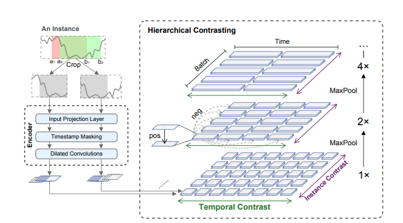

# TS2Vec : Toward Universal Representation of Time Series

Page : [https://arxiv.org/abs/2106.10466](https://arxiv.org/abs/2106.10466)

## Abstract

- TS2Vec performs contrastive learning in hierarchical way over augmented context view
- also perfrom superior results in time series forecasting and anomaly detection

## Introduction

- Recent study에서 contrastive learning을 통해 time series 데이터 고유 구조 자체를 사용해 학습 시도했지만 명확한 limitation 존재
- Limitation
    1. Instance-level representation에서 time series forecasting이나 anolmaly detection과 같은 task에는 fine-gradined representation이 적합하지 않음
    2. Multi-scale contextual information with different granularites를 적용한 TNC와 같이 random sub-series from original time series를 positive samples로 설정하는데 이는 scale-invariant information을 뽑아낸 것이 아닌 각 scale에 해당하는 sematic을 뽑아낸 것에 불과함
    3. 대부분의 unsupervised learning representation은 CV나 NLP의 method를 채용한 것이므로  time series 데이터에 적합하지 않을 가능성이 높음
- TS2Vec은 위의 limitation의 문제를 다룬다
    1. Instance-wise / temporal dimension 두 dimension의 positive와 negative pairs를 모두 고려함
    2. 해당 timestamps에 대하여 max pooling을 적용해서 contextual information의 fine-grained representation을 뽑아냄
    3. Two augmentation method를 사용해서 CV, NLP method에서 오는 불일치를 완화

## Method

- Model architecture
    
    
    
    - Input time series :
        
        $dim(x_i) = sequence ~of~length ~~*~~feature~dimension$
        
    - Encoder
        1. Input Projection Layer → Fully connected layer
        2. Timestamp Masking → Randomly selected timestamps
        3. Dilated Convolutions → 10 residual blocks ( Each block has to dilated 1D- CNN )
            - To extract contextual information
- Contextual Consistency
    - Problem
        1. Exist Level shift → vulnerable
        2. Anomalies occur → false positive pairs
    - Generate Context
        1. Timestamp Masking
            - Using binary mask for masking
            - Elements sampled from Bernoulli distribution with p = 0.5
        2. Random Cropping
            - Only applied in training phase
        
        → both method do not change the magnitude of the time series, whichi is important to time series
        
        → imporve robustness of learned representations
        
- Hierarchical Contrasting
    - Various scale에서 학습할 수 있도록 만든 representation을 학습
    - Representation의 학습은 Max pooling을 활용
    
    - Temporal Contrative Loss
        - Positive : Same timestatmp
        - Negative : Different timestamp
    - Instance-wise Contrastive Loss
        - Positive : Same time series
        - Negative : Different time series
    - Overall Loss
        - Temporal Contrastive Loss과 Instance-wise Contrastive Loss가 complementary를 고려한 Loss

### Experiments

- Time Series Classification
    - Label
        - 각 time series에 대해서 label 부여
    - SVM classifier with RBF kernel
- Time Series Forecasting
    - Predict
        - Future H observations
    - Linear Regression model with L2 Norm Penalty
    - Augmetation 적용 → accuracy decreased
- Time Series Anomaly Detection
    - Anomaly score = function ( mask - unmask )
- Model
    - Dilated CNN, LSTM, Transformer 실험
        - Dailated CNN is best
- Missing Data
    - Missing data makes accuracy decreased